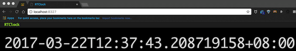

# rtclock

> An HTML5 Real Time Clock based on WebSocket

## Features
- [x] Use WebSocket to send backend real time clock to frontend.
- [x] Support go-bindata.

## Install
* `go get github.com/Akagi201/rtclock`

## Build
* `./gobin.sh` (when you modified the html template)
* `go build`

## Run
* `./rtclock -h`
* Simple usage: `./rtclock`
